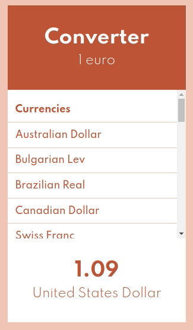

# Convertisseur v2

> En repartant du projet `converter`

## Calculer dynamiquement la conversion :muscle:

### Ajouter des informations dans le state de App 

  - le montant à convertir (le "1" qu'on a mis en dur dans le composant Header). Il faudra utiliser cette information dans le composant Header
  - le nom de la devise sélectionnée (le "United States Dollar" qu'on a mis en dur dans le composant Amount), et il faudra utiliser cette information dans le composant Amount
  
 :bulb: On peut visualiser le state d'un composant avec les DevTools, dans l'onglet Components

### Calculer la conversion

On va faire le calcul dans la méthode _render_ de App : on stocke le résultat du calcul dans une variable, on fournit cette variable au composant Amount pour qu'il affiche le résultat de la conversion plutôt que "1.09" en dur.

Algorithme pour calculer la conversion :
- récupérer le taux de conversion de la devise actuellement sélectionnée (il faudrait _trouver_ ça dans les données :thinking:... Mais si on ne voit vraiment pas comment faire, utiliser un taux de conversion en dur :sweat_smile:)
- multiplier le montant de base par le taux de conversion
- (BONUS) on pourrait pas limiter le nombre de décimales ? :nerd_face:

### Vérification du fonctionnement

Avec les DevTools, dans l'onglet Components, on peut _modifier_ une information qui est dans le state (et appuyer sur Entrée pour que la modification soit prise en compte) => si on change le montant à convertir, ça devrait modifier l'affichage (Header et Amount) :tada:

## BONUS : Ajouter la conversion lors du clic sur une devise

## Instructions

- Repartir de l'exemple du bouton pour masquer les devises
- Ajouter le handler (juste un console.log pour commencer)
- Mettre en place la modification du state
- Brancher le handler

## Whaaat ?

- https://react.dev/learn/writing-markup-with-jsx#the-rules-of-jsx
- https://react.dev/learn/javascript-in-jsx-with-curly-braces
- https://react.dev/reference/react/Component
- https://react.dev/learn/rendering-lists#keeping-list-items-in-order-with-key
- https://react.dev/learn/responding-to-events
